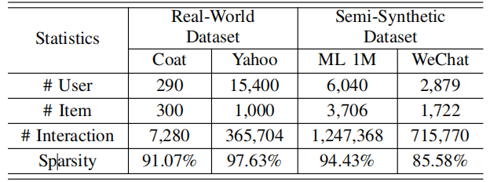
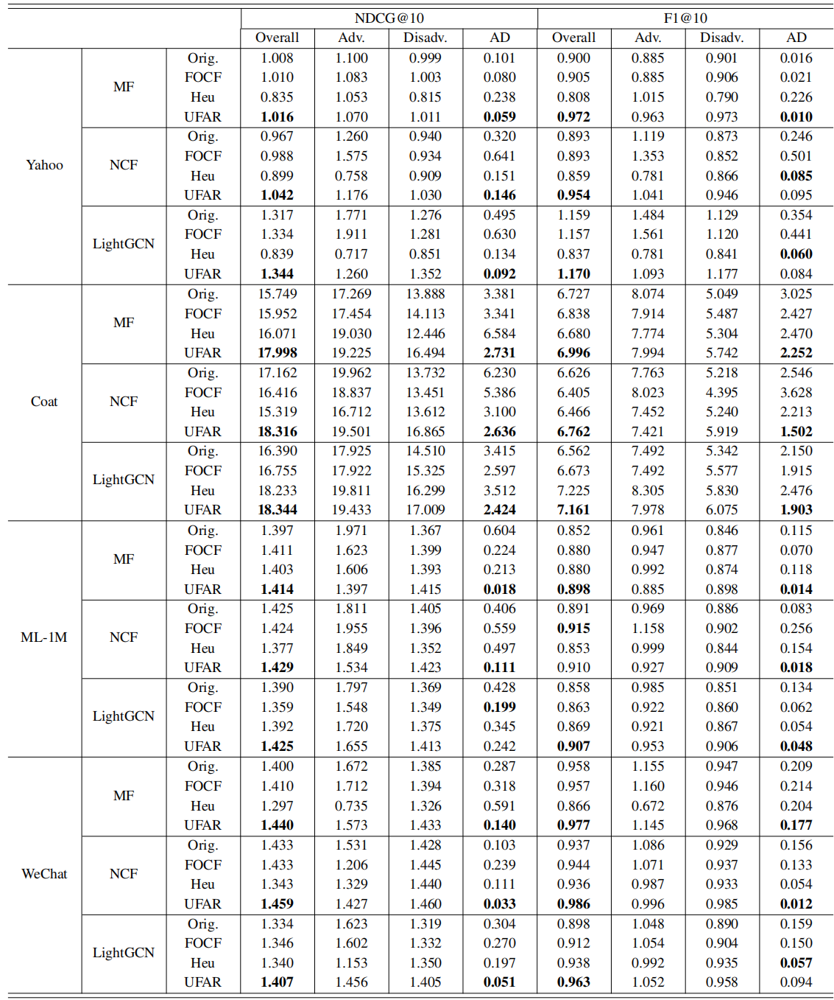

# 1. Abstract

Fairness in the recommendation domain has recently attracted increasing attention due to the more and more concerns on the algorithm discrimination and ethics. While recent years have witnessed many promising fairness aware recommender models, an important problem has been largely ignored, that is, if the training data is biased, then the fairness constraint imposed on the training data may not well generalize to the real unbiased user/item distributions. To study this problem, in this paper, we formally define a novel task named as unbiased fairness ware recommendation. For solving this task, we firstly define an ideal loss function based on all the user-item pairs. Considering that, in real-world datasets, only a small number of user-item interactions can be revealed, we then approximate the above ideal loss with a more tractable objective based on the inverse propensity score (IPS). In order to make the objective fully differentiable for the commonly used Top-N recommendation metrics such as F1, NDCG and HitRatio, we soft their computation processes to derive an end to end framework. Since the recommendation datasets can be noisy and quite sparse, which bring difficulties for accurately estimating the IPS, we propose a range-based method to improve the objective, where we allow the initially predicted IPS deviate from the real one by a small range. In the experiments, we conduct extensive experiments to demonstrate the effectiveness of our model based on four real-world datasets.

# 2. Contributions

- We analyze the potential bias of the fairness constraints in the recommendation domain, and propose to build an unbiased fairness aware recommendation framework.
- To achieve the above idea, we firstly define a differentiable objective for Top-N recommendation metrics. Then we adjust different samples based on IPS in both of the prediction target and fairness constraint, where we also propose a range-based method to improve the IPS estimation.
- We conduct extensive experiments to demonstrate the effectiveness of our model.

# 3. Dataset Information

<center>Table 1: Statistics of the datasets used in our experiments.</center>
<div align=center></div>

# 4. Main Results

<center>Table 2: Overall comparison between the baselines and our models.</center>
<div align=center></div>

# 5. Code Description

The structure of the code files is the same as [RecBole](https://github.com/RUCAIBox/RecBole) and our implementations are stored in **recbole/data/model/fair_recommender** directory.

# 6. Usage

1. Download the code
2. Download the datasets and put them into **datasets** directory.
3. Before running programs of our models, you should pre-estimate propensity-scores by running `run_recbole.py` and setting test.yaml for heu_mlp_p model.

    set parameters in test.yaml (taking WeChat dataset as example)

    ```yaml
    show_progress: True
    gpu_id: 0
    seed: 2022
    use_gpu: True
    state: INFO
    reproducibility: True
    data_path: 'dataset'
    checkpoint_dir: 'saved/heu_mlp_p'
    dataset: wechat
    save_dataset: False
    save_dataloaders: False

    # Data settings
    sample_by_user_group: True
    threshold: ~
    benchmark_filename: ~
    load_col:
      inter: [user_id, item_id]

    # model config
    model: heu_mlp_p
    embedding_size: 64
    weight_decay: 1e-5

    # training settings
    epochs: 1000
    train_batch_size: 512
    learner: adam
    eval_step: 1
    stopping_step: 10
    neg_sampling:
      uniform: 1
    learning_rate: 0.001

    # evalution settings
    eval_args:
      split: {'RS':[8,1,1]}
      group_by: None
      mode: uni1
    metrics: ["LogLoss"]
    valid_metric: LogLoss
    eval_batch_size: 4096
    loss_decimal_place: 5
    metric_decimal_place: 5
    ```
    where the meaning of each key can be seen in [RecBole API Doc](https://recbole.io/docs/).

    run program

    ```shell
    python run_recbole.py -m HEU_MLP_P -d wechat --config_files test.yaml
    ```
    where -m denotes model name. -d denotes dataset name. --config_files denotes config file name.

# 4. Run our framework
    
Use pre-estimated propensity score as $\hat{P}$ and set related parameters in test.yaml. We take UFAR_MF_MLP on WeChat dataset as example.

  set parameters in test.yaml
  
  ```yaml
  # Environment settings
  show_progress: True
  gpu_id: 0
  seed: 2022
  use_gpu: True
  state: INFO
  reproducibility: True
  data_path: 'dataset'
  checkpoint_dir: 'saved/ufar_mf_mlp'
  dataset: wechat
  save_dataset: False
  save_dataloaders: False

  # Data settings
  sample_by_user_group: True
  propensity_pretrain: 'saved/heu_mlp_p/your_model_pth_file_name'
  benchmark_filename: ['train','valid','test']
  threshold:  
  label: 1

  # model config
  model: UFAR_MF_MLP
  embedding_size: 64
  weight_decay: 1e-4

  tau: 1
  lambda1: 1000
  lambda2: 10
  softrank_K: 10

  # training settings
  epochs: 1000
  train_batch_size: 25600
  learner: adam
  eval_step: 1
  stopping_step: 10
  neg_sampling:
  uniform: 99

  learning_rate: 0.1
  ips_lr: 0.0001
  train_interval: 8

  # evalution settings
  eval_args:
  mode: full
  metrics: ["NDCG","Precision","Recall"]
  UGF: True
  valid_metric: NDCG@10
  topk: [10]
  eval_batch_size: 4096
  loss_decimal_place: 5
  metric_decimal_place: 5
  ```
  run program

  ```shell
  python run_recbole.py -m UFAR_MF_MLP -d wechat --config_files test.yaml
  ```
    

# 7. Detailed parameter search ranges

We fixed the embedding size and (positive sample) batch size as 64, 256, respectively, for all models while others are listed as follows.

| Hyper Parameters        | Tuning range          |
|:-------------:|:------------------|
| weight_decay           | {0,1e-5,1e-4,1e-3} |
| learning_rate | {0.001,0.01,0.1}   |
| dropout_prob           | {0,0.1,0.2,0.3}      |
| n_layers           | {1,2,3} |
| train_interval     | {1,2,4,8}    |
| lambda1     | {0.0001,0.001,0.01,0.1,1,10,100,1000}    |
| lambda2     | {0.01,0.1,1,10,100}    |
| tau     | {0.1,1,2,4,8,16}    |
| ips_lr     | {0.00001,0.00005,0.0001,0.0005,0.001}    |

# 8. Runtime Environment

- System: Linux, 20.04.1-Ubuntu
- CPU: Intel(R) Xeon(R) Gold 5318Y CPU @ 2.10GHz
- CPU-Memory: 512G
- GPU: NVIDIA A40(45G)
- Pytorch: 1.10.1+cu113
- CUDA: 11.3